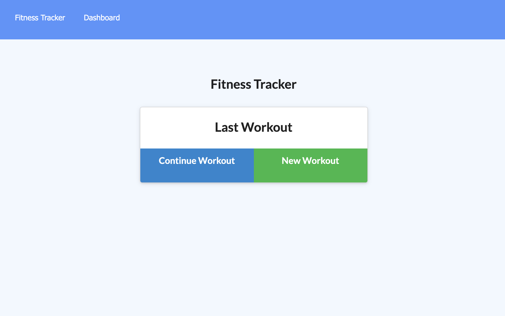

# Fitness-Tracker

App that tracks daily workouts using a Mongo database with a Mongoose schema and handle routes with Express

## Goal:

The goal was to connect the back end of a front-end fitness application utilizing express and mongoDB. The user should be able to view the most recent exercise, ass new workout plans, view the combined weight of multiple exercise and view the duration of each workout.

## Issues:

- CRUD actions were a challenge and will be re-visited in order to properly record data. Api.js routes specifically

## Results:

I was able to successfully link to MongoAtlas in order to connect my server to the MongoDB. I was able to use express and connect most of the pages. I was also able to create the workoutSchema in models.

### Github Link:

https://sbgastondesign.github.io/Fitness-Tracker/

### Heroku Link:

https://git.heroku.com/nameless-ocean-85982.git

## Future Updates:

- Revisit get/put routes.

### License

MIT License, Copyright (c) [2021] [StephanieGaston]

---

### Contact:

- Email: sbgastondesign@gmail.com
- Github: github.com/sbgastondesign
- LinkedIn: "http://www.linkedin.com/stephanie-gaston-1067217a/"
